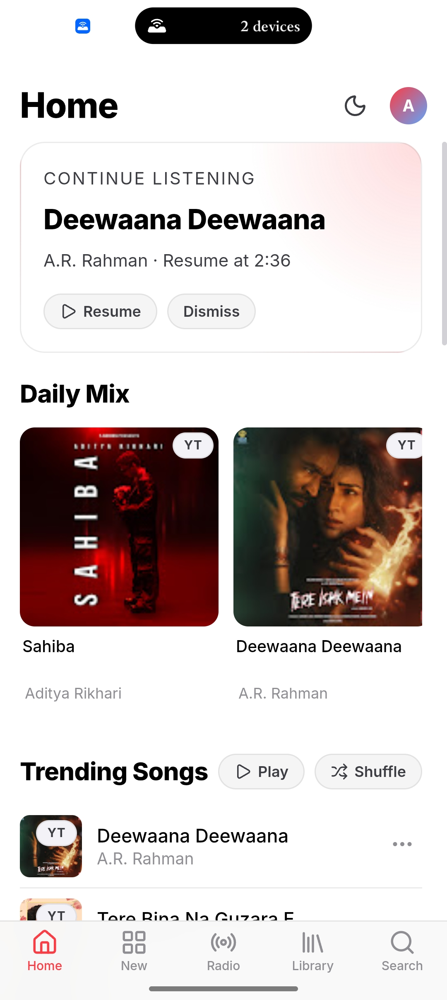
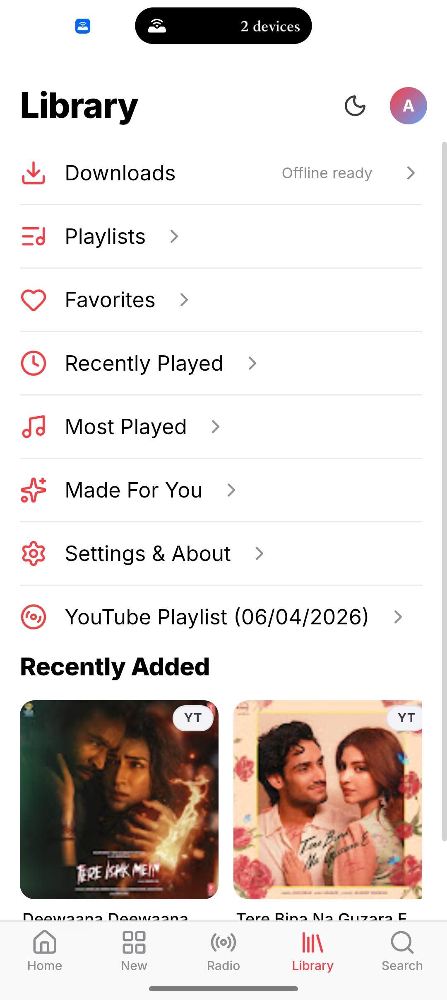
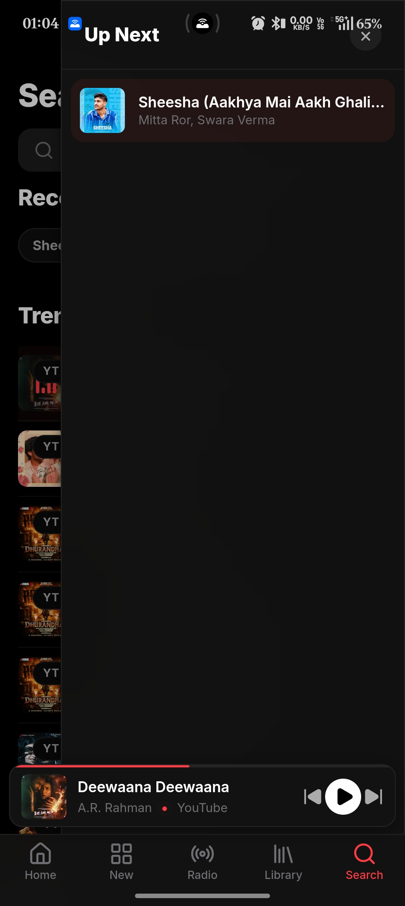
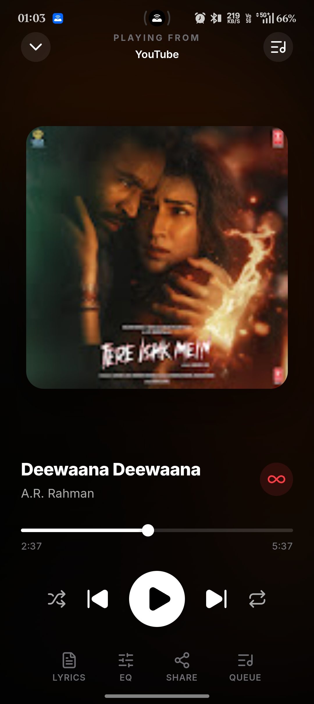
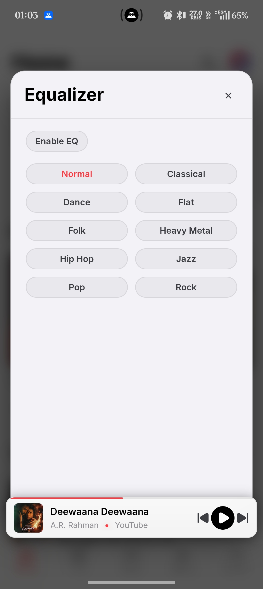
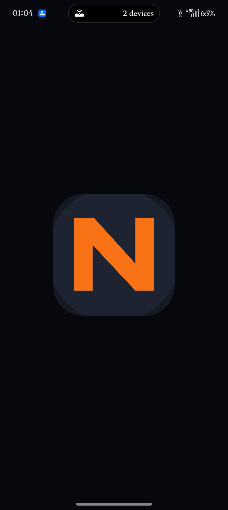

<p align="center">
  
</p>

<h1 align="center">Null</h1>
<p align="center"><strong>Free Music Player for Android - No Ads, No Limits</strong></p>

<p align="center">
  <a href="https://null-music.netlify.app/app-release.apk"></a>
  <a href="https://null-music.netlify.app"></a>
</p>

<p align="center">
  
  
  
  
  
</p>

---

## What is Null

Null is a free, open-source music player for Android with access to millions of songs, no ads, no subscriptions, and no tracking. It is built with React, Capacitor, and a resilient Node.js backend with fallback-aware playback.

Open-source, Android-first, and focused on speed, reliable playback, and offline continuity.

Website: [null-music.netlify.app](https://null-music.netlify.app)

Download: [Latest APK](https://null-music.netlify.app/app-release.apk)

---

## Highlights

- Fast search and metadata-rich discovery
- Fallback-aware playback pipeline for reliability
- Queue controls with dedupe and optimization
- Offline downloads and resume state handling
- Lyrics, equalizer hooks, and Android media controls
- Account sync for favorites, playlists, and history
- Music DNA profile with Sonic Twins recommendations

---

## Screenshots

| Home | Search | Queue |
| --- | --- | --- |
|  |  |  |

| Library | Playback | Features |
| --- | --- | --- |
|  |  |  |

| DNA Overview | DNA Traits | DNA Helix |
| --- | --- | --- |
|  |  |  |

---

## Features

### Core Playback

- Search, stream, and play music from multiple sources
- Queue management with next, previous, shuffle, and insert-next controls
- Playback resume state so users can continue where they left off
- Offline download support for saved tracks
- Reliability fallbacks when a source is unavailable

### Library and Discovery

- Favorites, playlists, recently played, and most-played views
- Personalized sections such as Made For You and trending mixes
- Search filters for songs, artists, albums, and playlists
- Download management and local library organization
- Radio-style station playback for quick discovery

### Listening Experience

- Lyrics view and equalizer integration hooks
- Android media controls and native playback support
- Playback profiles for data saver, balanced, and instant modes
- Auto-radio and queue optimization helpers
- Theme switching and mobile-first layout handling

### Account and Sync

- Sign up, login, and session persistence
- Favorites and playlist syncing across devices
- Listening history and library state persistence
- Feedback and issue reporting flows

### Music DNA

- Personalized Music DNA profile based on listening history
- Animated DNA helix visualization
- Genre, mood, tempo, acousticness, and decade analysis
- Sonic Twins recommendations for similar artists
- Shareable DNA card for social posting and discovery

### Platform and Reliability

- Android-first Capacitor shell with web fallback
- Backend fallback routes and metadata proxying
- Download and cache-aware architecture
- Rate limiting, auth, and request timeout protections

---

## Tech Stack

| Layer | Technology |
| --- | --- |
| Frontend | React + Vite |
| Android shell | Capacitor |
| Backend API | Node.js + Express |
| Stream resolution | yt-dlp primary with fallback strategy |
| Lyrics | LRCLIB |
| Auth | JWT + session persistence |

---

## Repository Layout

- `src/` React app and player state management
- `android/` Capacitor Android shell and native integration
- `backend/` provider, resolver, cache, auth, and utility modules
- `server.mjs` API server entry point
- `shared/` shared helpers used by multiple modules
- `tests/` unit and integration tests
- `website/` marketing website

---

## Local Development

### Prerequisites

- Node.js 22+
- npm 10+
- Java 21 for Android builds
- Android SDK for device builds

### Install and Run

```bash
git clone https://github.com/adit-ya15/music-player.git
cd music-player
npm install
npm run server
npm run dev
```

### Verify

```bash
npm run lint
npm test
npm run build
```

---

## Android Build

### Debug APK

```bash
npm run build
npx cap sync android
cd android
./gradlew assembleDebug
```

Output:

- `android/app/build/outputs/apk/debug/app-debug.apk`

### Release APK

See the full guide in [RELEASE_AND_UPDATE_GUIDE.md](./RELEASE_AND_UPDATE_GUIDE.md).

```bash
npm run build
npx cap sync android
cd android
./gradlew assembleRelease
```

---

## Documentation

| Document | Description |
| --- | --- |
| [ARCHITECTURE.md](./ARCHITECTURE.md) | System architecture and data flow |
| [SECURITY.md](./SECURITY.md) | Security practices and threat model |
| [PRIVACY.md](./PRIVACY.md) | Privacy policy and data handling |
| [CONTRIBUTING.md](./CONTRIBUTING.md) | How to contribute |
| [CODE_OF_CONDUCT.md](./CODE_OF_CONDUCT.md) | Community guidelines |
| [ROADMAP.md](./ROADMAP.md) | Feature roadmap and milestones |
| [CHANGELOG.md](./CHANGELOG.md) | Version history |
| [RELEASE_AND_UPDATE_GUIDE.md](./RELEASE_AND_UPDATE_GUIDE.md) | Build, sign, and release process |
| [OPEN_SOURCE_RELEASE_CHECKLIST.md](./OPEN_SOURCE_RELEASE_CHECKLIST.md) | Pre-release checklist |

---

## Environment

Use `.env.example` for local setup and `.env.production.example` for production defaults.

Never commit:

- `.env` values
- cookies files
- Android keystore credentials
- `android/keystore.properties`

---

## Contributing

Contributions are welcome. Please read [CONTRIBUTING.md](./CONTRIBUTING.md) before opening a pull request.

1. Fork the repository
2. Create a feature branch
3. Commit your changes
4. Push your branch
5. Open a pull request

---

## Support

Null is free and open-source. If you enjoy it, consider supporting development.

- UPI: `aditya262701@okicici`
- Website: [null-music.netlify.app/#support](https://null-music.netlify.app/#support)
- Star the repository

---

## License

MIT. See [LICENSE](./LICENSE).

---

<p align="center">
  Made with love by <a href="https://github.com/adit-ya15">Aditya</a>
</p>
